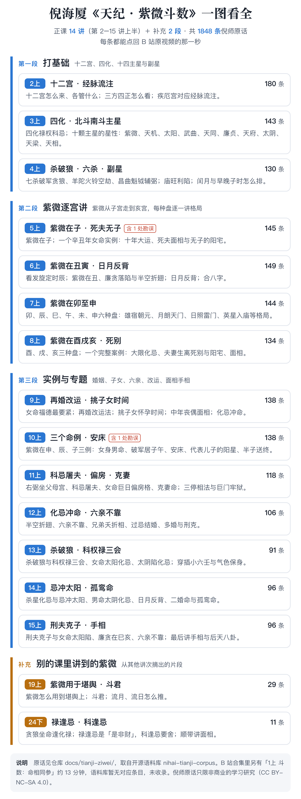

# 倪海厦《天纪 · 紫微斗数》原话

这里是倪海厦先生《天纪》课程中**紫微斗数部分**的原话，共 **1848 条**，按讲次整理。每条都带出处时间，点一下就跳回 B 站原视频的那一秒，可以自己核对。

内容取自姊妹仓库 [nihai-tianji-corpus](https://github.com/Renhuai123/nihai-tianji-corpus)（天纪全量语料，提交 `462faa4`），这里只是其中紫微部分的分讲版本，**内容以语料库为准**，会随语料库同步更新。



## 收录范围

- **紫微斗数 14 讲**：2上 至 15上，全部收录，共 1808 条。
- **补充 1**：19上 第 2–4 段，即紫微在堪舆中的运用、斗君、流月流日，共 29 条。
- **补充 2**：24下 里讲紫微的片段，共 11 条。

不收录的：

- **1上 的斗数片段（命相同参）**：《天纪》完结版的语料里没有对应条目。
- **完整逐字稿**：只收倪师原话短引文和出处，不含能还原整堂课的逐字稿。
- **视频截图和任何视听内容**：所有出处都是指向 B 站原视频页面的链接。

## 分讲目录

| 讲次 | 内容 | 条数 | 文件 |
|---|---|---|---|
| 2上 | 十二宫/经脉流注图 | 180 | [2上.md](./2上.md) |
| 3上 | 四化星/北斗星系/南斗星系 | 143 | [3上.md](./3上.md) |
| 4上 | 南斗星系/六杀星/副星/总格/离日绝日 | 130 | [4上.md](./4上.md) |
| 5上 | 紫微在子/死夫/无子宅 | 145 | [5上.md](./5上.md) |
| 6上 | 发旋定时辰/紫微在丑/日月反背/合八字/紫微在寅 | 149 | [6上.md](./6上.md) |
| 7上 | 紫微在卯/辰/巳/午/未/申 | 144 | [7上.md](./7上.md) |
| 8上 | 紫微在酉/戌/亥/夫妻生离死别 | 134 | [8上.md](./8上.md) |
| 9上 | 再婚改运法/挑子女时间/中年丧偶面相/化忌冲命 | 138 | [9上.md](./9上.md) |
| 10上 | 紫微在申/辰/子案例/女身男命/破军居子午/安床/杀破狼个性/晚婚/代表儿子的阳星/半子送终 | 138 | [10上.md](./10上.md) |
| 11上 | 右弼坐父母宫/科忌屠夫/女命巨日偏房格/克妻命 | 118 | [11上.md](./11上.md) |
| 12上 | 化忌冲命/六亲不靠/兄弟夭折相/过忌结婚/多婚 | 106 | [12上.md](./12上.md) |
| 13上 | 杀破狼/科权禄三会/小六壬/太阴陷化忌/红鸾天喜化忌 | 91 | [13上.md](./13上.md) |
| 14上 | 忌冲太阳/男命太阴陷/太阴化忌入命/孤鸾命 | 96 | [14上.md](./14上.md) |
| 15上 | 刑夫剋子/女命太阳陷/廉贪在巳亥/六亲不靠/手相 | 96 | [15上.md](./15上.md) |
| 19上 | 补充1（19上 第 2–4 段：紫微在堪舆中的运用、斗君、流月流日） | 29 | [19上_补充1.md](./19上_补充1.md) |
| 24下 | 补充2（24下 里的紫微片段） | 11 | [24下_补充2.md](./24下_补充2.md) |

## 每一条长什么样

```
- [00:36:09](https://www.bilibili.com/video/BV1KJsLekEfA?p=9&t=2169) 「倪师原话」〔考据标注〕　册目
```

- **时间**：这句话在该集视频里的起始时间，点开就从这一秒开始播。
- **「」里**：倪师原话。只删口语赘词和识别噪声、补标点，不改字。
- **〔〕里**：考据标注。
  - 字幕错字经人工裁决改正的，写作「已按裁决改正：错字→正字」。
  - 倪师讲解里经排盘验算确认的笔误，写作「勘误：……」，原话照留。目前有 5上 一处，相关 4 条，说明见[语料库勘误页](https://github.com/Renhuai123/nihai-tianji-corpus/blob/main/docs/%E5%8B%98%E8%AF%AF.md)。
- **册目**：这句话在语料库十一册体系里的位置，比如「主星 › 紫微 · 定性」。

`entries.jsonl` 是同一批内容的机器可读版本，一行一条，字段与语料库相同，说明见[语料库字段说明](https://github.com/Renhuai123/nihai-tianji-corpus/blob/main/data/schema.md)。

## 许可

本目录采用 **CC BY-NC-SA 4.0**：可以引用、转载，须注明出处；**不许商用**；改编后的作品须用同样的协议。本目录不适用仓库根目录的 MIT 与 CC BY 4.0，详见 [LICENSE.md](./LICENSE.md)。

## 版权与致谢

- 《天纪》课程内容的著作权归**倪海厦先生及其权利继承人**所有。
- 本目录的引文是**倪师的口述原话**。整理以 B 站公开视频为素材，经文字识别、双语音引擎交叉核验和人工勘误得出；相关事宜已与视频上传者沟通并获知悉。
- 出处链接指向 B 站原视频页面，方便读者回放核对，也为原视频带去访问。
- 权利方对任何内容提出异议，我们收到通知后会**立即下架**相应部分。

内容属传统文化研究与学习资料，不构成任何医疗、投资或人生决策建议。
